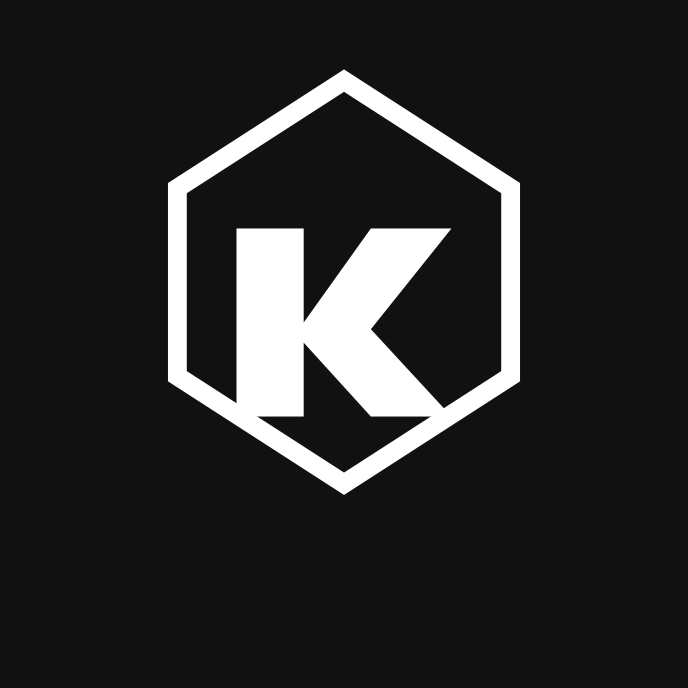
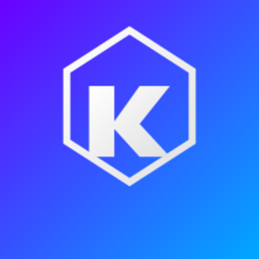

## **KrunixBase Icon Pack v1.0**

A modern, scalable, and minimalistic icon pack for the KrunixBase ecosystem.  
Includes full‑resolution **SVG sources** and ready‑to‑use **PNG exports** in multiple sizes.  
Designed for applications, dashboards, documentation, and branding materials.

---

## **Folder Structure**

```
icons/
    ├── png/
    │   ├── 220/
    │   └── 512/
    └── svg/
        ├── *.svg
        └── variants/
            ├── mono/
            ├── outline/
            ├── premium/
            └── solid/
```

---

## **SVG Variants Overview**

### **Main SVG Files**
- krunixbase_logo_dark.svg  
- krunixbase_logo_dark_green.svg  
- krunixbase_logo_gradient.svg  
- krunixbase_logo_green.svg  
- krunixbase_logo_light.svg  
- krunixbase_logo_monochrome.svg  

### **Variant Sets (`svg/variants/`)**
- **mono/** — monochrome versions  
- **outline/** — line‑style versions  
- **premium/** — gradient and enhanced versions  
- **solid/** — filled versions  

---

## **PNG Exports**

### **220px (UI / App Ready)**
Located in:
```
icons/png/220/
```

### **512px (Branding / Social Media)**
Located in:
```
icons/png/512/
```

---

## **Usage Examples**

### **HTML**
```html

```

### **React / Next.js**
```jsx
import Logo from '../icons/svg/krunixbase_logo_gradient.svg';

export default function Header() {
  return <Logo width={48} height={48} />;
}
```

### **Markdown**
```markdown

```

---

## **Design Philosophy**

The icon pack is structured to support multiple design contexts:

- **Solid** — strong, bold, product‑ready  
- **Outline** — lightweight UI elements  
- **Mono** — documentation, diagrams, low‑contrast environments  
- **Premium** — gradients, marketing, hero sections  

This ensures consistent branding across all KrunixBase materials.

---

## **License — CC‑BY‑4.0**

This icon pack is licensed under the **Creative Commons Attribution 4.0 International License (CC‑BY‑4.0)**.

You are free to:

- **Share** — copy and redistribute the material  
- **Adapt** — remix, transform, and build upon the material  

Under the following terms:

- **Attribution** — You must give appropriate credit and indicate if changes were made.  
- No additional restrictions may be applied.

Full license text:  
`https://creativecommons.org/licenses/by/4.0/` [(creativecommons.org in Bing)](https://www.bing.com/search?q="https%3A%2F%2Fcreativecommons.org%2Flicenses%2Fby%2F4.0%2F")
